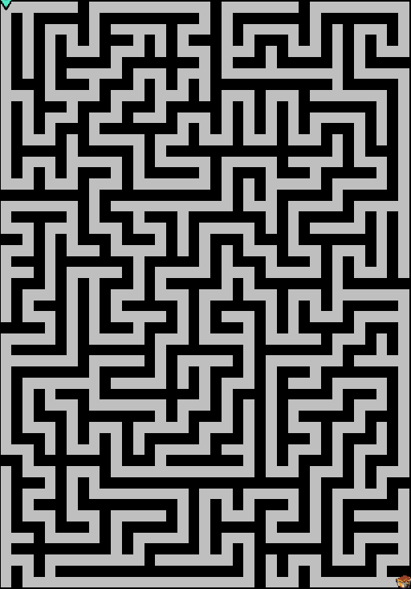

# arknights_museum_navigator
明日方舟博物馆大发现最短路导航工具。

- 游戏链接 https://ak.hypergryph.com/activity/discovermuseum/
- 正在思考怎么用 Rust WASM 重构此项目，有会相关技术的同志欢迎联系。

## 导航效果示例

### 输入图像

- 请注意：输入图像应尽可能不带地图外的边界图像，以免算法分析格子宽度时出错

### 输出图像

## 前置条件

- `make`
- `g++`
- `python3`
  - `pip3 install pillow`

## 使用方式

- `python3 main.py <输入图像路径> <锤子数量>`

